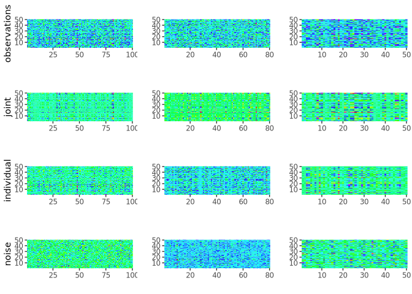

<!-- README.md is generated from README.Rmd. Please edit that file -->

# rajiveutils

<!-- badges: start -->

<!-- badges: end -->

rajiveutils (Robust Angle based Joint and Individual Variation
Explained) is a robust alternative to the aJIVE method for the
estimation of joint and individual components in the presence of
outliers in multi-source data. It decomposes the multi-source data into
joint, individual and residual (noise) contributions. The decomposition
is robust with respect to outliers and other types of noises present in
the data.

## Installation

You can install the released version of rajiveutils from
[CRAN](https://CRAN.R-project.org) with:

``` r
install.packages("rajiveutils")
```

And the development version from [GitHub](https://github.com/) with:

``` r
# install.packages("devtools")
devtools::install_github("mdmanurung/RaJIVEutils")
```

## Example

This is a basic example which shows how to use rajiveutils on simple
simulated data:

### Running robust aJIVE

``` r
library(rajiveutils)
## basic example code
n <- 50
pks <- c(100, 80, 50)
Y <- ajive.data.sim(K =3, rankJ = 3, rankA = c(7, 6, 4), n = n,
                   pks = pks, dist.type = 1)

initial_signal_ranks <-  c(7, 6, 4)
data.ajive <- list((Y$sim_data[[1]]), (Y$sim_data[[2]]), (Y$sim_data[[3]]))
ajive.results.robust <- Rajive(data.ajive, initial_signal_ranks)
```

The function returns a list of class `"rajive"` containing the RaJIVE
decomposition, with the joint component (shared across data sources),
individual component (data source specific) and residual component for
each data source.

### Inspecting the decomposition

- Print a concise overview:

``` r
print(ajive.results.robust)
#> RaJIVE Decomposition
#>   Number of blocks : 3
#>   Joint rank       : 2
#>   Individual ranks : 6, 5, 2
```

- Summary table of all ranks:

``` r
summary(ajive.results.robust)
#>   block joint_rank individual_rank
#>  block1          2               6
#>  block2          2               5
#>  block3          2               2
get_all_ranks(ajive.results.robust)
#>    block joint_rank individual_rank
#> 1 block1          2               6
#> 2 block2          2               5
#> 3 block3          2               2
```

- Joint rank:

``` r
get_joint_rank(ajive.results.robust)
#> [1] 2
```

- Individual ranks:

``` r
get_individual_rank(ajive.results.robust, 1)
#> [1] 6
get_individual_rank(ajive.results.robust, 2)
#> [1] 5
get_individual_rank(ajive.results.robust, 3)
#> [1] 2
```

- Shared joint scores (n × joint_rank matrix):

``` r
get_joint_scores(ajive.results.robust)
```

- Block-specific scores and loadings:

``` r
# Joint scores for block 1
get_block_scores(ajive.results.robust, k = 1, type = "joint")
#>                [,1]         [,2]
#>  [1,] -0.1394751666 -0.050804688
#>  [2,]  0.1198928579 -0.226972298
#>  [3,] -0.0373309235  0.034072563
#>  [4,]  0.1808582163 -0.086392597
#>  [5,]  0.1779003540  0.309271094
#>  [6,]  0.2398001064  0.064001270
#>  [7,] -0.0180452382  0.001153290
#>  [8,] -0.1413878957  0.166307930
#>  [9,] -0.1408348112 -0.300498110
#> [10,]  0.1422526284 -0.218507722
#> [11,]  0.0527506559 -0.082573209
#> [12,]  0.0657886159 -0.091621648
#> [13,] -0.0238956336 -0.128639766
#> [14,]  0.0116950664  0.009403486
#> [15,]  0.0414044490  0.029699123
#> [16,]  0.3502648592 -0.088857038
#> [17,] -0.1837776470  0.193831946
#> [18,]  0.0538411786 -0.120165448
#> [19,] -0.0108206727  0.083193748
#> [20,]  0.1709012939 -0.222225299
#> [21,] -0.0481601184  0.045491021
#> [22,]  0.0526003779  0.162349036
#> [23,]  0.1924369375  0.041231605
#> [24,] -0.1989272552 -0.125286414
#> [25,] -0.1856724369  0.215590139
#> [26,] -0.2286948719  0.099357955
#> [27,]  0.0007061748 -0.021763428
#> [28,]  0.0449359783 -0.055738772
#> [29,] -0.1691680472 -0.068256072
#> [30,] -0.0963015988 -0.201752122
#> [31,]  0.0316661551  0.122256001
#> [32,] -0.2623003013 -0.078618228
#> [33,] -0.0464663045 -0.002947326
#> [34,] -0.0760503642 -0.111823676
#> [35,]  0.0652109012  0.088587385
#> [36,]  0.1133509119  0.158337082
#> [37,]  0.0481904781 -0.126345456
#> [38,]  0.1038374769  0.286743635
#> [39,]  0.1290602713 -0.230629131
#> [40,] -0.0874897845 -0.027796484
#> [41,] -0.0369173881 -0.004258920
#> [42,]  0.0965357735 -0.229795705
#> [43,] -0.1555492336 -0.019085578
#> [44,]  0.0516607754 -0.062697186
#> [45,]  0.0072879504 -0.075140832
#> [46,]  0.0820633666 -0.157220835
#> [47,] -0.1272605479 -0.254261492
#> [48,]  0.1166190713 -0.012427435
#> [49,] -0.3476422252 -0.026082078
#> [50,] -0.2206561000 -0.009693884

# Individual loadings for block 2
get_block_loadings(ajive.results.robust, k = 2, type = "individual")
#>               [,1]         [,2]          [,3]         [,4]         [,5]
#>  [1,] -0.085708466 -0.018415931 -0.0630329248 -0.085466160 -0.078090429
#>  [2,]  0.047595173 -0.107143339  0.1688664812 -0.038142148 -0.031407192
#>  [3,] -0.152258157 -0.150294248  0.0912094148  0.042289824  0.029366043
#>  [4,]  0.053093355 -0.012028820 -0.0697415349  0.101984552  0.226671049
#>  [5,] -0.019199669  0.089401913  0.0681978112  0.025608569 -0.059061125
#>  [6,]  0.109406876  0.130626467 -0.0783945222  0.057694244 -0.005252635
#>  [7,] -0.151567182  0.103904528 -0.0702465706  0.056914946 -0.331557859
#>  [8,]  0.017025293 -0.032718326 -0.0233623557 -0.065742827 -0.046413369
#>  [9,]  0.032568382  0.263366738  0.0006863963  0.053312647  0.011106636
#> [10,]  0.106492721 -0.026816473  0.0760229976  0.025602085  0.069824598
#> [11,] -0.160619416  0.091320472 -0.1786700493 -0.133195198 -0.073350876
#> [12,]  0.064757889 -0.071671257 -0.2427054807  0.041241534  0.075165602
#> [13,]  0.180663955  0.057338611 -0.1154475193  0.106082246 -0.120989698
#> [14,]  0.025087178  0.095494296 -0.1275783477 -0.186360800  0.034837902
#> [15,] -0.139120972  0.121304011 -0.0909655658  0.097057727 -0.066956818
#> [16,]  0.031827356 -0.256277108 -0.1006677815 -0.033237963  0.125303259
#> [17,] -0.087322493 -0.025098589 -0.0666959885  0.041297509 -0.154590070
#> [18,]  0.031163502 -0.013567853 -0.2316822183  0.141058340  0.017125912
#> [19,]  0.202382134 -0.070650281  0.0760443482 -0.056355518  0.134126084
#> [20,] -0.073940892 -0.225452390  0.1943651336 -0.037902662 -0.002094080
#> [21,] -0.034233853  0.146321521  0.2317141199  0.180715681  0.041319033
#> [22,] -0.034249905  0.015721633 -0.1005713653 -0.029908214 -0.111636756
#> [23,] -0.086588845  0.093640100 -0.1901973077  0.007465244 -0.096739615
#> [24,]  0.265183842  0.021407560 -0.1428384204  0.030123639 -0.133423150
#> [25,]  0.051479607 -0.155840386 -0.1270937140 -0.218062828 -0.055171572
#> [26,] -0.043939294 -0.036469776 -0.0005638452 -0.242512185 -0.101121466
#> [27,] -0.011330687  0.035172968  0.0850497705 -0.009399629  0.018547609
#> [28,]  0.012753492  0.016226840  0.0660633310  0.008405484 -0.015607762
#> [29,]  0.074409734 -0.089123678 -0.1287094121 -0.014969101  0.097373804
#> [30,]  0.073080410 -0.162249641 -0.0170350167  0.018432335 -0.250700465
#> [31,] -0.037356445 -0.081366800 -0.0587941894  0.088865114  0.118723866
#> [32,] -0.190535490  0.062061047 -0.0338473314 -0.280640469  0.007474293
#> [33,]  0.182276005 -0.098604651  0.0724072496 -0.195543210  0.049270279
#> [34,] -0.076259213 -0.037377451  0.0459506305 -0.007478297 -0.116183120
#> [35,]  0.053347441 -0.088879533  0.0776491397 -0.080262331 -0.044924370
#> [36,] -0.101888222 -0.032583385  0.2263263181  0.056462505  0.159985903
#> [37,]  0.032306405  0.005460701  0.0618483656  0.015253755 -0.150445669
#> [38,] -0.155399616  0.181824122 -0.0019851720  0.033786990  0.058939028
#> [39,] -0.160740223 -0.007606331 -0.0547378207 -0.085416868  0.130803345
#> [40,] -0.062494885  0.039402959 -0.0484315210 -0.017530715  0.140021937
#> [41,] -0.068353397 -0.130214840 -0.1716116664 -0.060675515  0.075001045
#> [42,] -0.015580882  0.032576553 -0.0167352291 -0.067505791  0.139699753
#> [43,]  0.027866301  0.065875508  0.3274805243 -0.127762938 -0.031487329
#> [44,]  0.171635725 -0.106622697 -0.0780350233  0.127641243 -0.114817060
#> [45,]  0.088328203  0.125372025  0.1006481776  0.063860732  0.145688644
#> [46,] -0.023754351  0.028817817 -0.0179320407  0.072801921  0.067506281
#> [47,]  0.007708329  0.102085702 -0.0615692102 -0.299533890  0.112703809
#> [48,]  0.008895266  0.009061096 -0.2147150224  0.019468331 -0.075118374
#> [49,] -0.045857766 -0.063383803 -0.0355748040  0.012849301  0.089053703
#> [50,] -0.063605353  0.134708048  0.0922488768  0.138135039  0.128407564
#> [51,]  0.018138850 -0.014089774 -0.0813650318  0.007690571  0.059109687
#> [52,]  0.157548250  0.022309301  0.0466578607 -0.057254444  0.080713214
#> [53,]  0.198893631  0.008451016  0.0113587907 -0.099331350  0.110383421
#> [54,] -0.053757989 -0.094022468  0.1069294959  0.055483356  0.218496182
#> [55,] -0.127591182  0.137198763 -0.0193887881 -0.075802786  0.149086910
#> [56,] -0.110018363 -0.179198116 -0.0652479796  0.083346859 -0.041779075
#> [57,] -0.004026532  0.050192008  0.1305821995  0.093790272 -0.149658051
#> [58,]  0.086532082  0.027953800 -0.1427890406  0.042984754  0.172617877
#> [59,] -0.084391396  0.109278718  0.0880867445  0.004365258 -0.027088655
#> [60,]  0.156105448 -0.208962305  0.0096395797 -0.075673276 -0.042380144
#> [61,] -0.175360945 -0.049494305  0.0778834368 -0.076077804  0.031443075
#> [62,] -0.018069060 -0.052694311  0.2033833647  0.268519445 -0.089999841
#> [63,] -0.112072554 -0.097344912 -0.0212634169  0.002104423  0.042073567
#> [64,]  0.013065043  0.074915868  0.0174767815 -0.441261671  0.005888312
#> [65,]  0.107573354  0.146379452 -0.0807274422  0.021918599  0.063529247
#> [66,] -0.056121238 -0.014603260 -0.0251177735  0.014996234  0.183830290
#> [67,] -0.130857852  0.084328521  0.0459380864 -0.057915585  0.147403800
#> [68,] -0.005529784 -0.290186880 -0.0391436763 -0.025817590 -0.169494825
#> [69,] -0.075455539  0.101506325  0.0255352564  0.006865310 -0.182600066
#> [70,]  0.008577333 -0.254652592  0.0387369812  0.179654803  0.189852470
#> [71,] -0.124460440 -0.067708414  0.0994412184 -0.016063450 -0.065333998
#> [72,] -0.115243289 -0.151639402 -0.1398059423  0.091774120  0.087650429
#> [73,] -0.090667363 -0.169532740 -0.0395392297  0.116533043  0.060291646
#> [74,] -0.120328530 -0.095717790  0.2028570429 -0.063343715 -0.171846236
#> [75,] -0.245394292 -0.020146652 -0.0427557428  0.120799012  0.005749098
#> [76,]  0.047208313  0.112695727 -0.0430759064  0.081024162  0.039343977
#> [77,] -0.115913795  0.112729912 -0.1154717073  0.077841445  0.017861611
#> [78,]  0.373869281  0.110940761  0.1093946321  0.038820254 -0.033814941
#> [79,] -0.022784366  0.104880918  0.0512834602 -0.014161862 -0.076286626
#> [80,]  0.055073633  0.112202971  0.0027187450 -0.082984609  0.061227343
```

- Full reconstructed matrices (J, I, or E) for a block:

``` r
J1 <- get_block_matrix(ajive.results.robust, k = 1, type = "joint")
I2 <- get_block_matrix(ajive.results.robust, k = 2, type = "individual")
E3 <- get_block_matrix(ajive.results.robust, k = 3, type = "noise")
```

### Visualizing results

- Heatmap decomposition:

``` r
decomposition_heatmaps_robustH(data.ajive, ajive.results.robust)
```



- Proportion of variance explained (as a list):

``` r
showVarExplained_robust(ajive.results.robust, data.ajive)
#> $Joint
#> [1] 0.2768646 0.2734908 0.4336092
#> 
#> $Indiv
#> [1] 0.5873406 0.5611743 0.2963845
#> 
#> $Resid
#> [1] 0.1357948 0.1653349 0.2700063
```

- Proportion of variance explained (as a bar chart):

``` r
plot_variance_explained(ajive.results.robust, data.ajive)
```

- Scatter plot of scores (e.g. joint component 1 vs 2 for block 1):

``` r
plot_scores(ajive.results.robust, k = 1, type = "joint",
            comp_x = 1, comp_y = 2)

# Colour points by a grouping variable
group_labels <- rep(c("A", "B"), each = n / 2)
plot_scores(ajive.results.robust, k = 1, type = "joint",
            comp_x = 1, comp_y = 2, group = group_labels)
```

### Jackstraw significance testing

After running the RaJIVE decomposition, you can test which variables in
each data block have statistically significantly non-zero joint loadings
using the jackstraw permutation test:

``` r
# Run jackstraw test (increase n_null to 50-100 for publication-quality results)
js <- jackstraw_rajive(ajive.results.robust, data.ajive,
                       alpha = 0.05, n_null = 10,
                       correction = "bonferroni")

# Print a concise summary table
print(js)

# Get a data frame summary
summary(js)
```

- Retrieve significant variables for a given block and component:

``` r
get_significant_vars(js, block = 1, component = 1)
```

- Visualize jackstraw results (three plot types available):

``` r
# P-value histogram
plot_jackstraw(js, type = "pvalue_hist", block = 1, component = 1)

# F-statistic vs -log10(p-value) scatter plot
plot_jackstraw(js, type = "scatter", block = 1, component = 1)

# Heatmap of -log10(p-value) across all joint components for one block
plot_jackstraw(js, type = "loadings_significance", block = 1)
```

## Function reference

### Core decomposition

| Function | Description |
|----|----|
| `Rajive()` | Run the RaJIVE decomposition on a list of data matrices. Returns an object of class `"rajive"`. |
| `ajive.data.sim()` | Simulate multi-block data with known joint and individual structure for testing and benchmarking. |

### Rank accessors

| Function | Description |
|----|----|
| `get_joint_rank()` | Extract the estimated joint rank from a `"rajive"` object. |
| `get_individual_rank()` | Extract the individual rank for a specific data block. |
| `get_all_ranks()` | Return a `data.frame` of joint and individual ranks for all blocks at once. |

### Component accessors

| Function | Description |
|----|----|
| `get_joint_scores()` | Return the shared n x r_J joint score matrix (r_J = joint rank). |
| `get_block_scores()` | Return the score matrix (U) for a given block and component type (joint or individual). |
| `get_block_loadings()` | Return the loading matrix (V) for a given block and component type. |
| `get_block_matrix()` | Return the full reconstructed matrix (J, I, or E) for a given block and component type. |

### S3 methods for `"rajive"` objects

| Function | Description |
|----|----|
| `print.rajive()` | Print a concise summary of ranks for a `"rajive"` object. |
| `summary.rajive()` | Return and print a `data.frame` of all estimated ranks. |

### Variance explained

| Function | Description |
|----|----|
| `showVarExplained_robust()` | Compute the proportion of variance explained by joint, individual, and residual components for each block (returns a list). |
| `plot_variance_explained()` | Stacked bar chart of variance explained by each component and block. |

### Visualisation

| Function | Description |
|----|----|
| `decomposition_heatmaps_robustH()` | Heatmaps of the raw data and the joint, individual, and noise components for all blocks. |
| `plot_scores()` | Scatter plot of two score components for a given block (joint or individual), with optional group colouring. |

### Jackstraw significance testing

| Function | Description |
|----|----|
| `jackstraw_rajive()` | Run the jackstraw permutation test to identify variables with significantly non-zero joint loadings. Returns a `"jackstraw_rajive"` object. |
| `print.jackstraw_rajive()` | Print a significance table for a `"jackstraw_rajive"` object. |
| `summary.jackstraw_rajive()` | Return and print a `data.frame` summary of jackstraw results. |
| `get_significant_vars()` | Extract significant variable names/indices for a given block and component from jackstraw results. |
| `plot_jackstraw()` | Diagnostic plots for jackstraw results: p-value histogram, F-stat scatter plot, or loadings significance heatmap. |
