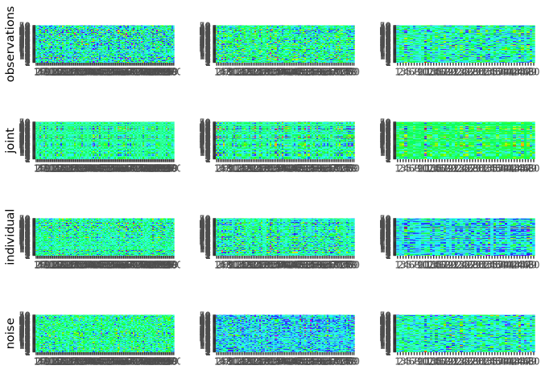
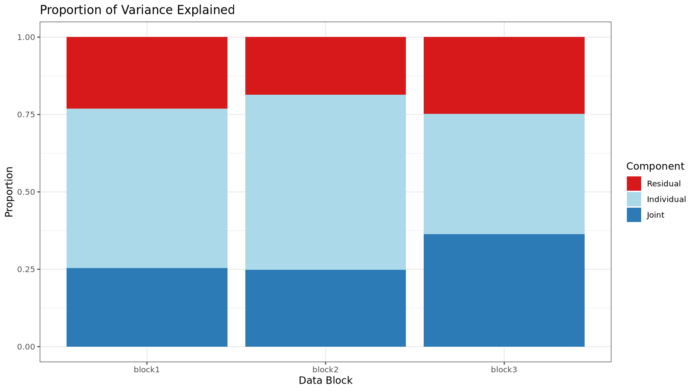
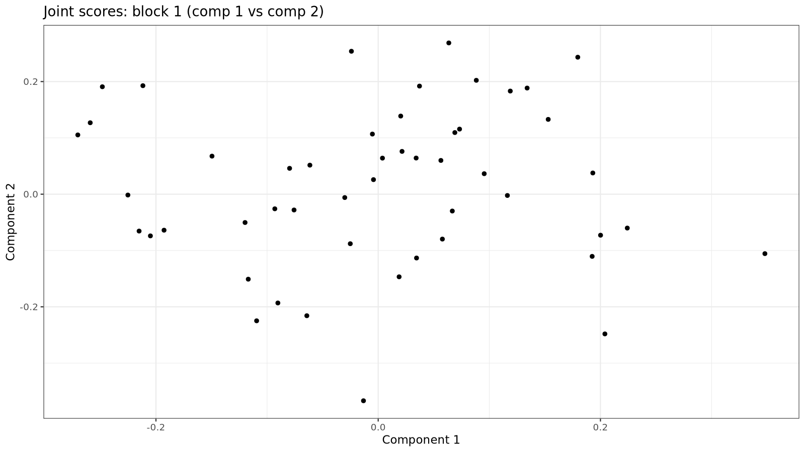
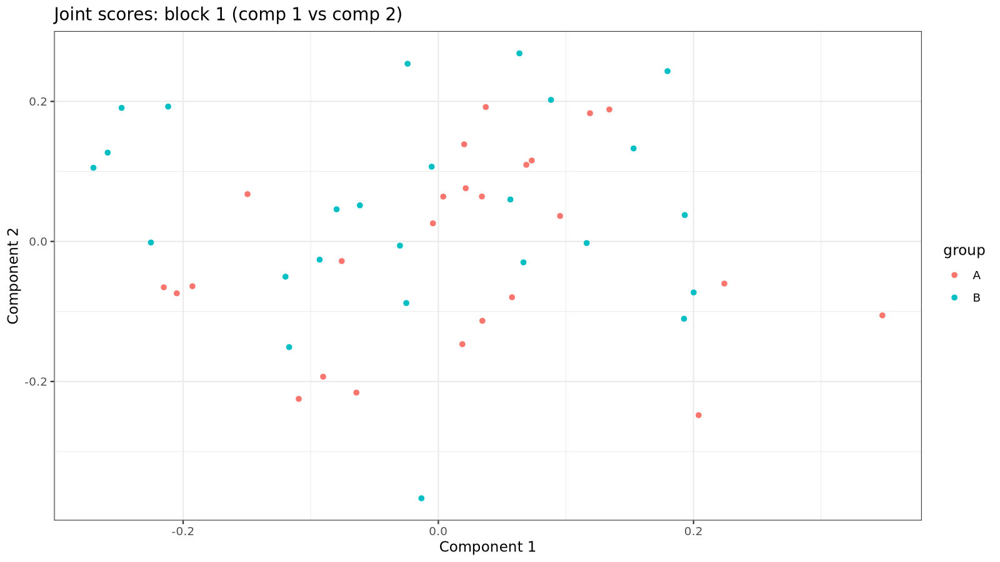
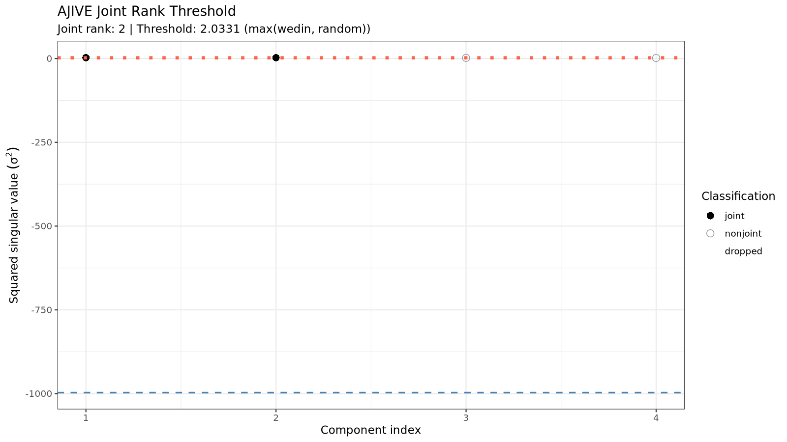
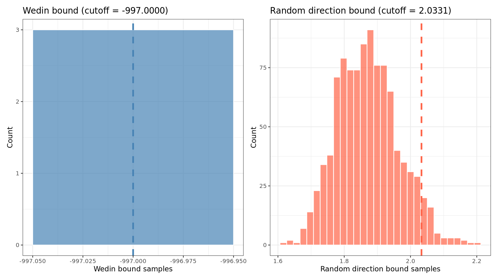
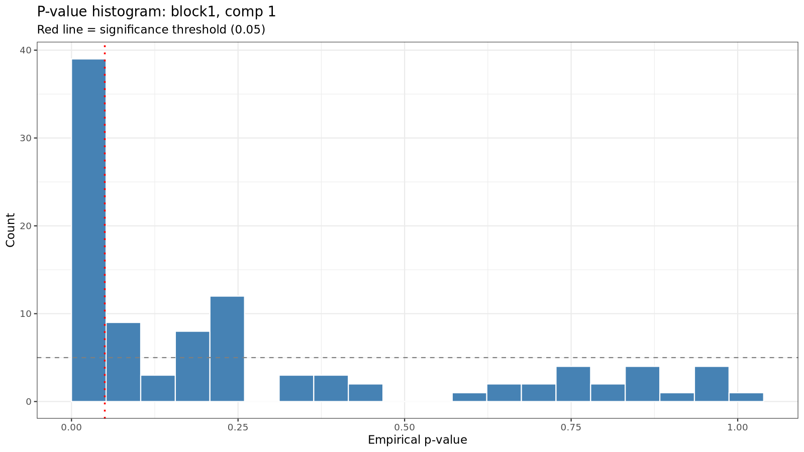
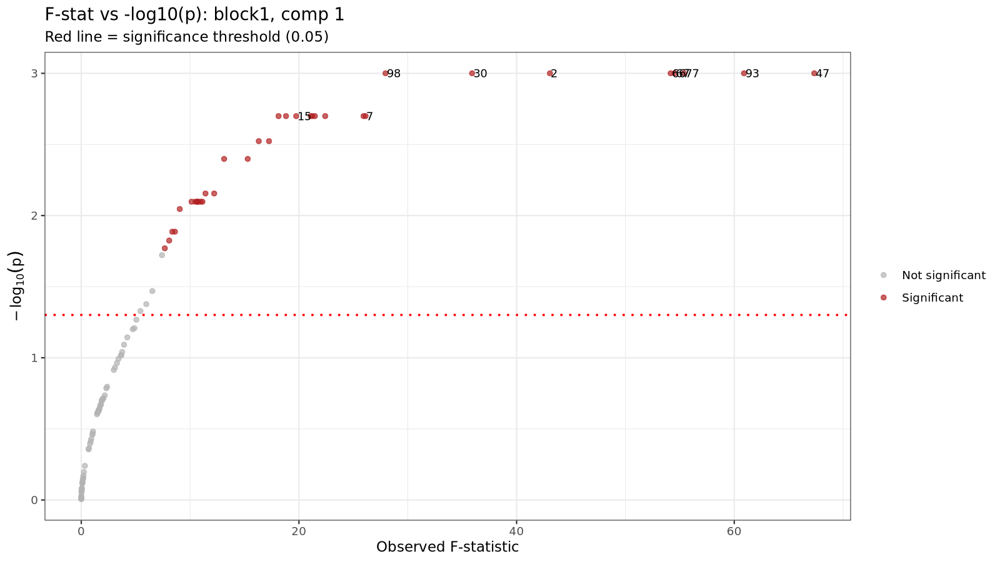
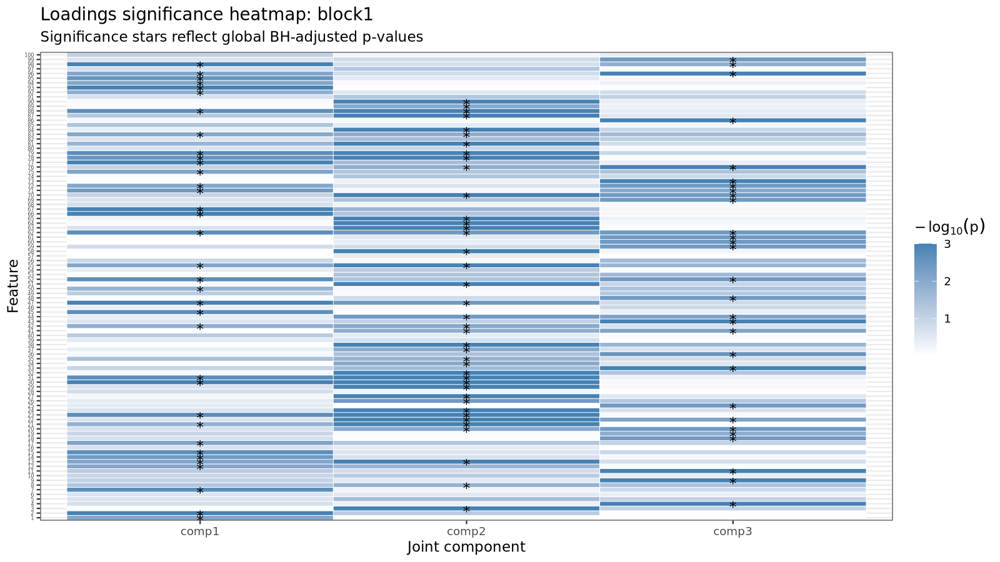

<!-- README.md is generated from README.Rmd. Please edit that file -->

``` r
knitr::opts_chunk$set(
  collapse = TRUE,
  comment = "#>",
  fig.path = "man/figures/README-",
  out.width = "100%"
)
```

# rajiveplus

<!-- badges: start -->

<!-- badges: end -->

rajiveplus (Robust Angle based Joint and Individual Variation Explained)
is a robust alternative to the aJIVE method for the estimation of joint
and individual components in the presence of outliers in multi-source
data. It decomposes the multi-source data into joint, individual and
residual (noise) contributions. The decomposition is robust with respect
to outliers and other types of noises present in the data.

## Installation

You can install the released version of rajiveplus from
[CRAN](https://CRAN.R-project.org) with:

``` r
install.packages("rajiveplus")
```

And the development version from [GitHub](https://github.com/) with:

``` r
# install.packages("devtools")
devtools::install_github("mdmanurung/rajiveplus")
```

## Example

This is a basic example which shows how to use rajiveplus on simple
simulated data:

### Running robust aJIVE

``` r
library(rajiveplus)
## basic example code
n <- 50
pks <- c(100, 80, 50)
Y <- ajive.data.sim(K =3, rankJ = 3, rankA = c(7, 6, 4), n = n,
                   pks = pks, dist.type = 1)

initial_signal_ranks <-  c(7, 6, 4)
data.ajive <- list((Y$sim_data[[1]]), (Y$sim_data[[2]]), (Y$sim_data[[3]]))
ajive.results.robust <- Rajive(data.ajive, initial_signal_ranks)
#> Loading required package: foreach
#> Loading required package: rngtools
```

The function returns a list of class `"rajive"` containing the RaJIVE
decomposition, with the joint component (shared across data sources),
individual component (data source specific) and residual component for
each data source.

### Inspecting the decomposition

- Print a concise overview:

``` r
print(ajive.results.robust)
#> RaJIVE Decomposition
#>   Number of blocks : 3
#>   Joint rank       : 3
#>   Individual ranks : 5, 4, 1
```

- Summary table of all ranks:

``` r
summary(ajive.results.robust)
#>   block joint_rank individual_rank
#>  block1          3               5
#>  block2          3               4
#>  block3          3               1
get_all_ranks(ajive.results.robust)
#>    block joint_rank individual_rank
#> 1 block1          3               5
#> 2 block2          3               4
#> 3 block3          3               1
```

- Joint rank:

``` r
get_joint_rank(ajive.results.robust)
#> [1] 3
```

- Individual ranks:

``` r
get_individual_rank(ajive.results.robust, 1)
#> [1] 5
get_individual_rank(ajive.results.robust, 2)
#> [1] 4
get_individual_rank(ajive.results.robust, 3)
#> [1] 1
```

- Shared joint scores (n × joint_rank matrix):

``` r
get_joint_scores(ajive.results.robust)
#>               [,1]        [,2]         [,3]
#>  [1,] -0.103745578  0.06420655 -0.243908865
#>  [2,] -0.039781637  0.20102009  0.152989020
#>  [3,] -0.156582313  0.15266415 -0.068293455
#>  [4,]  0.211655946  0.01865297 -0.138298032
#>  [5,] -0.016644408 -0.05653466  0.116900240
#>  [6,]  0.421383405 -0.01993942 -0.070779417
#>  [7,] -0.031882464 -0.00740296  0.093749633
#>  [8,] -0.123779802 -0.10567752  0.078634356
#>  [9,]  0.124243729  0.13995311  0.209245948
#> [10,] -0.164118597 -0.03779285  0.086530757
#> [11,]  0.152844466  0.10907929 -0.069968835
#> [12,] -0.057061784 -0.07622980 -0.141251196
#> [13,]  0.133440760 -0.09710107 -0.024166976
#> [14,] -0.135916896 -0.07945784  0.044461489
#> [15,]  0.287108682  0.22003692 -0.139419697
#> [16,] -0.037493847  0.10622925  0.016056440
#> [17,]  0.003477208 -0.04497856  0.082378793
#> [18,]  0.124553592 -0.03873744  0.105449421
#> [19,] -0.143729573 -0.11765572  0.169629313
#> [20,]  0.054473031  0.05113834  0.120556475
#> [21,] -0.154176103  0.05262609 -0.146633803
#> [22,]  0.154439693  0.01902775 -0.082365767
#> [23,]  0.085524295  0.11158494  0.241256357
#> [24,]  0.015032916  0.29965747 -0.080848366
#> [25,]  0.026404474 -0.14855856 -0.085480102
#> [26,]  0.239073434 -0.05721325  0.021700054
#> [27,]  0.132335878 -0.11605981 -0.207421092
#> [28,] -0.024221515 -0.03736764 -0.042073324
#> [29,]  0.028997944  0.23418099 -0.006611994
#> [30,] -0.094331984  0.17619813  0.006068255
#> [31,] -0.153705227  0.07967167 -0.219693509
#> [32,]  0.129107770  0.14022026 -0.069837431
#> [33,]  0.263933767 -0.09287955 -0.045949518
#> [34,]  0.146987168 -0.02532612  0.295846661
#> [35,] -0.065801255  0.14499384 -0.118529875
#> [36,]  0.142282348 -0.08137173 -0.310506842
#> [37,] -0.178429967 -0.03837431 -0.132226794
#> [38,]  0.108936873 -0.02833682  0.042395931
#> [39,] -0.111741369 -0.20079451 -0.291070095
#> [40,]  0.123104882 -0.10631660  0.120146914
#> [41,]  0.049844469 -0.20698530 -0.003661433
#> [42,] -0.127424679  0.04335375  0.237139443
#> [43,] -0.219829241  0.04284051  0.122445612
#> [44,] -0.117248224 -0.25159073 -0.104789744
#> [45,]  0.021893829 -0.25130788 -0.052406982
#> [46,] -0.119342738  0.11893690 -0.066888575
#> [47,] -0.056622147 -0.03747531  0.174985469
#> [48,] -0.126581772 -0.41038669 -0.011016976
#> [49,] -0.014969109  0.13044962 -0.119196650
#> [50,] -0.112245029  0.24609034 -0.219825789
```

- Block-specific scores and loadings:

``` r
# Joint scores for block 1
get_block_scores(ajive.results.robust, k = 1, type = "joint")
#>              [,1]          [,2]         [,3]
#>  [1,] -0.03339590 -0.2695387388  0.038630507
#>  [2,]  0.08754408  0.0274383596 -0.239832947
#>  [3,] -0.02536406 -0.1807020344 -0.144931331
#>  [4,]  0.17869516 -0.0427266221  0.172570819
#>  [5,] -0.05088661  0.1148806470 -0.035286937
#>  [6,]  0.31473580  0.1093424748  0.268699485
#>  [7,] -0.03191830  0.0690862787 -0.063246761
#>  [8,] -0.16233430  0.0631199063 -0.036129171
#>  [9,]  0.17496753  0.1622796038 -0.145850049
#> [10,] -0.15219027  0.0257376341 -0.106714558
#> [11,]  0.18655376 -0.0463147271  0.043965696
#> [12,] -0.08630155 -0.1070776272  0.099974133
#> [13,]  0.04425591  0.0714868850  0.146940611
#> [14,] -0.15464197  0.0189957712 -0.041036849
#> [15,]  0.35991850 -0.1000396993  0.076853213
#> [16,]  0.03551741 -0.0456939614 -0.099352994
#> [17,] -0.02727849  0.0888934963 -0.013619079
#> [18,]  0.06916142  0.1513998891  0.031549633
#> [19,] -0.18776759  0.1363706384 -0.088662412
#> [20,]  0.06959975  0.0994559722 -0.073029375
#> [21,] -0.08226870 -0.2027903186 -0.033280379
#> [22,]  0.13314043 -0.0180210029  0.112029098
#> [23,]  0.12682930  0.1862170043 -0.164396008
#> [24,]  0.19709265 -0.1880959285 -0.148517522
#> [25,] -0.06783581  0.0015514464  0.160449275
#> [26,]  0.14866231  0.1329128257  0.149013958
#> [27,]  0.03733727 -0.0735084801  0.260448833
#> [28,] -0.04023210 -0.0284465921  0.035903941
#> [29,]  0.16561989 -0.0933510969 -0.138506608
#> [30,]  0.03475595 -0.1051060449 -0.169908241
#> [31,] -0.06318360 -0.2748575002 -0.010764672
#> [32,]  0.18727964 -0.0683546123  0.010832628
#> [33,]  0.14806995  0.1010730188  0.223103754
#> [34,]  0.08891532  0.3127755399 -0.071247443
#> [35,]  0.04143266 -0.1848525761 -0.065428285
#> [36,]  0.06929864 -0.1702067100  0.299308705
#> [37,] -0.15699202 -0.1615851521  0.007332399
#> [38,]  0.06537654  0.0885866666  0.051439448
#> [39,] -0.20003879 -0.1999831313  0.238322451
#> [40,]  0.02631569  0.1916123715  0.067995131
#> [41,] -0.08792686  0.1032281501  0.166399625
#> [42,] -0.07886532  0.1308041864 -0.225610829
#> [43,] -0.14694895  0.0004710372 -0.209232778
#> [44,] -0.24092335 -0.0255331227  0.166525662
#> [45,] -0.13508145  0.0707471676  0.208744920
#> [46,] -0.01730870 -0.1511688705 -0.103986401
#> [47,] -0.07180418  0.1400318381 -0.100705536
#> [48,] -0.34795434  0.1160289180  0.216357442
#> [49,]  0.07174670 -0.1599848258 -0.029228230
#> [50,]  0.07044807 -0.3294836637 -0.101020914

# Individual loadings for block 2
get_block_loadings(ajive.results.robust, k = 2, type = "individual")
#>               [,1]          [,2]          [,3]         [,4]
#>  [1,] -0.086888257 -0.0893700218  0.0974414491 -0.078516606
#>  [2,] -0.026360141 -0.1355462467 -0.1728995220  0.162894575
#>  [3,] -0.112943014 -0.1367659366  0.0923106667  0.012133544
#>  [4,] -0.091155739 -0.1929081993  0.0402552223  0.221777751
#>  [5,]  0.006220304  0.0857943682 -0.1180727495  0.014426163
#>  [6,]  0.085508094 -0.0565746720 -0.1376786805 -0.026213196
#>  [7,]  0.138574875 -0.0666535142 -0.0528828010 -0.153481806
#>  [8,]  0.180985973  0.0522466722  0.1081006327 -0.005807283
#>  [9,]  0.283907398 -0.0176850203  0.0683103150  0.016441646
#> [10,] -0.384138785  0.0952697980 -0.1059463826  0.086431845
#> [11,]  0.047291085  0.1264265551 -0.0880969633 -0.010629935
#> [12,] -0.116115649 -0.1308073995 -0.0427161030 -0.010120215
#> [13,]  0.016909015 -0.1087239689  0.0298339534 -0.098251918
#> [14,] -0.053890472 -0.0559721303  0.1404263223  0.066555781
#> [15,] -0.022160327  0.0088385017 -0.2059134392 -0.197658151
#> [16,]  0.014154352 -0.0072674039  0.0647451319  0.145857685
#> [17,] -0.035376863 -0.0847626288  0.0123768862 -0.010452803
#> [18,] -0.007010835  0.0178526945 -0.0978198010 -0.072237295
#> [19,] -0.012206491 -0.0516080974 -0.0438823740 -0.081510018
#> [20,]  0.115087417 -0.1017308210 -0.1090168045  0.047086247
#> [21,]  0.032497840  0.0557212809 -0.1574370543  0.005616993
#> [22,]  0.293171606 -0.0787540928  0.0938598273 -0.111124640
#> [23,] -0.017843249  0.1558816778  0.1738497633  0.156683868
#> [24,] -0.165949053 -0.1152821674 -0.0661373128 -0.146490985
#> [25,]  0.108919077 -0.0950968160  0.0549197000  0.010196088
#> [26,] -0.056955169  0.2005218066  0.3028691377 -0.026745778
#> [27,] -0.066389870  0.1084428816  0.0770716951 -0.068390598
#> [28,]  0.105865839 -0.0521721907 -0.1063297468 -0.006728378
#> [29,] -0.149502890  0.0809034354 -0.0329408805  0.075342225
#> [30,] -0.103074151 -0.2021130250  0.1347512396 -0.271904654
#> [31,] -0.161891340  0.1692110426 -0.2077306650  0.085606765
#> [32,] -0.036257652 -0.1067418975 -0.1304946303 -0.078313505
#> [33,] -0.171672296 -0.0085523829  0.0418649582  0.019289630
#> [34,]  0.085008147 -0.1714787538 -0.0236101957 -0.151261698
#> [35,] -0.203828070  0.0147172101  0.0701766890  0.034162845
#> [36,] -0.054127466 -0.0357921566  0.0550176549  0.052476330
#> [37,] -0.147438732  0.0670034873  0.0464051933 -0.049814468
#> [38,] -0.127038561 -0.1244119771 -0.1587670626 -0.065348510
#> [39,] -0.036950744 -0.0858785181  0.1273790511  0.084759065
#> [40,] -0.024904401 -0.1773599986  0.0514443646 -0.076321477
#> [41,]  0.008956855  0.1110302014 -0.1480538969 -0.157951257
#> [42,] -0.145138095 -0.0020616180  0.0993172358  0.172432389
#> [43,]  0.036614772 -0.0049307197 -0.0391527798  0.070264769
#> [44,]  0.027901050 -0.1083236779  0.0074413558 -0.086337389
#> [45,]  0.045972480  0.0361740807  0.0615387907  0.035039677
#> [46,] -0.172119143 -0.0285655548  0.0137535086 -0.128387759
#> [47,] -0.051170825 -0.1101262883 -0.0229801605 -0.071209844
#> [48,] -0.140095965  0.1106435052  0.1370502687 -0.181838545
#> [49,] -0.195009048 -0.1195910474 -0.0557405715 -0.008339343
#> [50,] -0.020079005  0.0552201695 -0.1809125714 -0.296891006
#> [51,]  0.131235107 -0.0627814217 -0.1374979332  0.015973139
#> [52,] -0.010810090 -0.1709160640 -0.0167242560  0.085766602
#> [53,] -0.011106115 -0.2502111970 -0.0001277912 -0.020585870
#> [54,]  0.117219276 -0.2387745786  0.0169008415 -0.122804588
#> [55,]  0.120050023  0.1291091028 -0.0938790326  0.027946133
#> [56,] -0.062924150 -0.1170792603 -0.0141923959 -0.026124669
#> [57,]  0.060476650  0.0998618170 -0.1110072761 -0.137908139
#> [58,]  0.050611930 -0.0459177445 -0.0087652718  0.203592526
#> [59,]  0.059421101 -0.1750521124  0.0629856509  0.125808058
#> [60,]  0.020160398 -0.1574714243 -0.1010186515  0.010928685
#> [61,] -0.010105808  0.0655279658 -0.0793061223 -0.059213748
#> [62,]  0.032663722 -0.0122778705 -0.1323847910  0.029461692
#> [63,] -0.174425269 -0.1117806727  0.0006451320 -0.164936073
#> [64,]  0.016907119  0.1649941739  0.1493931690  0.001525812
#> [65,] -0.129901066 -0.0001187405  0.0849894527 -0.173726781
#> [66,]  0.019627822 -0.1545011105 -0.0382349680  0.073544608
#> [67,] -0.004039482  0.0552771676  0.0072134726  0.052297822
#> [68,]  0.046813283 -0.0074637183  0.3284500811 -0.066469082
#> [69,] -0.037861985  0.0258700842  0.1632044555  0.062315651
#> [70,] -0.081686174 -0.0885791572  0.2017997694 -0.075128950
#> [71,]  0.054613132  0.0003439514 -0.1348697273  0.059717047
#> [72,]  0.089673120  0.0258688165 -0.1670819362  0.208519019
#> [73,] -0.078557818 -0.0855400955  0.0306159013 -0.023114808
#> [74,] -0.052251495  0.0966232989 -0.0794328133 -0.171624356
#> [75,] -0.096766523 -0.0399421203 -0.0001415276 -0.049413579
#> [76,]  0.062050721 -0.0866343204  0.0601319778 -0.088799550
#> [77,] -0.198692204 -0.0325559866 -0.1799609970  0.105581589
#> [78,]  0.035089953 -0.2528515756  0.0400273744  0.143417118
#> [79,] -0.089308311 -0.1226063173 -0.0195660578  0.240577469
#> [80,] -0.071484374 -0.1713499517 -0.0421112444  0.141561199
```

- Full reconstructed matrices (J, I, or E) for a block:

``` r
J1 <- get_block_matrix(ajive.results.robust, k = 1, type = "joint")
I2 <- get_block_matrix(ajive.results.robust, k = 2, type = "individual")
E3 <- get_block_matrix(ajive.results.robust, k = 3, type = "noise")
```

### Visualizing results

- Heatmap decomposition:

``` r
decomposition_heatmaps_robustH(data.ajive, ajive.results.robust)
```



``` r
knitr::include_graphics("man/figures/README-heatmap-1.png")
```


- Proportion of variance explained (as a list):

``` r
showVarExplained_robust(ajive.results.robust, data.ajive)
#> $Joint
#> [1] 0.3166052 0.3069283 0.4725695
#> 
#> $Indiv
#> [1] 0.5069358 0.4795150 0.1929407
#> 
#> $Resid
#> [1] 0.1764590 0.2135567 0.3344898
```

- Proportion of variance explained (as a bar chart):

``` r
png("man/figures/README-variance-explained.png", width = 1600, height = 900, res = 150)
print(plot_variance_explained(ajive.results.robust, data.ajive))
dev.off()
#> png 
#>   2

```


- Scatter plot of scores (e.g. joint component 1 vs 2 for block 1):

``` r
png("man/figures/README-scores-joint.png", width = 1600, height = 900, res = 150)
print(plot_scores(ajive.results.robust, k = 1, type = "joint",
                  comp_x = 1, comp_y = 2))
dev.off()
#> png 
#>   2

```


``` r

# Colour points by a grouping variable
group_labels <- rep(c("A", "B"), each = n / 2)
png("man/figures/README-scores-joint-grouped.png", width = 1600, height = 900, res = 150)
print(plot_scores(ajive.results.robust, k = 1, type = "joint",
                  comp_x = 1, comp_y = 2, group = group_labels))
dev.off()
#> png 
#>   2

```


### Jackstraw significance testing

After running the RaJIVE decomposition, you can test which variables in
each data block have statistically significantly non-zero joint loadings
using the jackstraw permutation test.

By default, `jackstraw_rajive()` applies global BH correction across all
block/component/feature tests.

``` r
# Run jackstraw test (increase n_null to 50-100 for publication-quality results)
js <- jackstraw_rajive(ajive.results.robust, data.ajive,
                       alpha = 0.05, n_null = 10)

# Print a concise summary table
print(js)
#> JIVE Jackstraw Significance Test
#>   Joint rank: 3   Alpha: 0.05   Correction: BH
#> 
#>   Block      Component    N features     N significant 
#>   ----------------------------------------------------
#>   block1     comp1        100            35            
#>   block1     comp2        100            40            
#>   block1     comp3        100            29            
#>   block2     comp1        80             22            
#>   block2     comp2        80             26            
#>   block2     comp3        80             27            
#>   block3     comp1        50             21            
#>   block3     comp2        50             17            
#>   block3     comp3        50             21

# Get a data frame summary
summary(js)
#>   block component n_features n_significant alpha correction
#>  block1     comp1        100            35  0.05         BH
#>  block1     comp2        100            40  0.05         BH
#>  block1     comp3        100            29  0.05         BH
#>  block2     comp1         80            22  0.05         BH
#>  block2     comp2         80            26  0.05         BH
#>  block2     comp3         80            27  0.05         BH
#>  block3     comp1         50            21  0.05         BH
#>  block3     comp2         50            17  0.05         BH
#>  block3     comp3         50            21  0.05         BH
```

### AJIVE diagnostics and interpretation helpers

The package now includes unified helpers for diagnostics, metadata
association, and bootstrap stability assessment:

``` r
# Extract AJIVE rank diagnostics (wide or long format)
diag_wide <- extract_components(ajive.results.robust, what = "rank_diagnostics")
diag_long <- extract_components(ajive.results.robust, what = "rank_diagnostics", format = "long")
head(diag_long)
#>   component_index obs_sval obs_sval_sq classification joint_rank_estimate
#> 1               1 1.648432    2.717327          joint                   3
#> 2               2 1.560888    2.436372          joint                   3
#> 3               3 1.496518    2.239566          joint                   3
#> 4               4 1.229970    1.512827       nonjoint                   3
#>   overall_sv_sq_threshold wedin_cutoff rand_cutoff perm_cutoff
#> 1                 2.03402         -997     2.03402          NA
#> 2                 2.03402         -997     2.03402          NA
#> 3                 2.03402         -997     2.03402          NA
#> 4                 2.03402         -997     2.03402          NA

# Unified diagnostic plots
png("man/figures/README-rank-threshold.png", width = 1600, height = 900, res = 150)
print(plot_components(ajive.results.robust, plot_type = "rank_threshold"))
dev.off()
#> png 
#>   2

```


``` r
png("man/figures/README-bound-distributions.png", width = 1600, height = 900, res = 150)
print(plot_components(ajive.results.robust, plot_type = "bound_distributions"))
dev.off()
#> png 
#>   2

```


``` r

# Associate estimated joint scores with sample-level metadata
metadata_df <- data.frame(group = rep(c("A", "B"), each = n / 2))
associate_components(ajive.results.robust, metadata_df,
                     variable = "group", mode = "categorical")
#> [associate_components] NOTE: Component scores are estimated quantities. Score estimation error is NOT propagated into the returned p-values. Treat results as post-decomposition exploratory associations, not exact fixed-design inference (StatisticalAudits.md, Finding 4).
#>   variable component      stat   p_value     p_adj  method
#> 1    group         1 0.3057882 0.5802763 0.5802763 kruskal
#> 2    group         2 0.8855529 0.3466853 0.5200279 kruskal
#> 3    group         3 0.8855529 0.3466853 0.5200279 kruskal

# Bootstrap stability of estimated joint rank
assess_stability(ajive.results.robust, data.ajive, initial_signal_ranks,
                 target = "joint_rank", B = 20)
#> removing column 4
#> removing column 3
#> removing column 3
#> $rank_distribution
#>  [1] 2 2 3 2 3 3 2 2 3 2 2 2 2 2 3 2 2 3 2 2
#> 
#> $rank_table
#> rank_draws
#>  2  3 
#> 14  6 
#> 
#> $observed_rank
#> [1] 3
```

- Retrieve significant variables for a given block and component:

``` r
get_significant_vars(js, block = 1, component = 1)
#>  [1]  1  2  7 12 13 14 15 17 21 23 30 31 42 45 47 50 52 55 62 66 67 71 72 75 77
#> [26] 78 79 83 88 92 93 94 95 96 98
```

- Visualize jackstraw results (three plot types available):

``` r
# P-value histogram
png("man/figures/README-jackstraw-pvalue-hist.png", width = 1600, height = 900, res = 150)
print(plot_jackstraw(js, type = "pvalue_hist", block = 1, component = 1))
dev.off()
#> png 
#>   2

```


``` r

# F-statistic vs -log10(p-value) scatter plot
png("man/figures/README-jackstraw-scatter.png", width = 1600, height = 900, res = 150)
print(plot_jackstraw(js, type = "scatter", block = 1, component = 1))
dev.off()
#> png 
#>   2

```


``` r

# Heatmap of -log10(p-value) across all joint components for one block
png("man/figures/README-jackstraw-loadings-significance.png", width = 1600, height = 900, res = 150)
print(plot_jackstraw(js, type = "loadings_significance", block = 1))
dev.off()
#> png 
#>   2

```


## Function reference

### Core decomposition

| Function | Description |
|----|----|
| `Rajive()` | Run the RaJIVE decomposition on a list of data matrices. Returns an object of class `"rajive"`. |
| `ajive.data.sim()` | Simulate multi-block data with known joint and individual structure for testing and benchmarking. |

### Rank accessors

| Function | Description |
|----|----|
| `get_joint_rank()` | Extract the estimated joint rank from a `"rajive"` object. |
| `get_individual_rank()` | Extract the individual rank for a specific data block. |
| `get_all_ranks()` | Return a `data.frame` of joint and individual ranks for all blocks at once. |

### Component accessors

| Function | Description |
|----|----|
| `get_joint_scores()` | Return the shared n x r_J joint score matrix (r_J = joint rank). |
| `get_block_scores()` | Return the score matrix (U) for a given block and component type (joint or individual). |
| `get_block_loadings()` | Return the loading matrix (V) for a given block and component type. |
| `get_block_matrix()` | Return the full reconstructed matrix (J, I, or E) for a given block and component type. |

### S3 methods for `"rajive"` objects

| Function | Description |
|----|----|
| `print.rajive()` | Print a concise summary of ranks for a `"rajive"` object. |
| `summary.rajive()` | Return and print a `data.frame` of all estimated ranks. |

### Variance explained

| Function | Description |
|----|----|
| `showVarExplained_robust()` | Compute the proportion of variance explained by joint, individual, and residual components for each block (returns a list). |
| `plot_variance_explained()` | Stacked bar chart of variance explained by each component and block. |

### Diagnostics and interpretation

| Function | Description |
|----|----|
| `extract_components()` | Extract AJIVE rank diagnostics in wide-list or long-data-frame format. |
| `plot_components()` | Unified AJIVE diagnostic plotting (`rank_threshold`, `bound_distributions`, `ajive_diagnostic`). |
| `associate_components()` | Test associations between estimated component scores and sample metadata. |
| `assess_stability()` | Bootstrap-based stability assessment for joint rank or loadings (with Procrustes alignment for loadings). |

### Visualisation

| Function | Description |
|----|----|
| `decomposition_heatmaps_robustH()` | Heatmaps of the raw data and the joint, individual, and noise components for all blocks. |
| `plot_scores()` | Scatter plot of two score components for a given block (joint or individual), with optional group colouring. |

### Jackstraw significance testing

| Function | Description |
|----|----|
| `jackstraw_rajive()` | Run the jackstraw permutation test to identify features significantly associated with estimated joint scores. Default multiple-testing correction is global BH across all tests. |
| `print.jackstraw_rajive()` | Print a significance table for a `"jackstraw_rajive"` object. |
| `summary.jackstraw_rajive()` | Return and print a `data.frame` summary of jackstraw results. |
| `get_significant_vars()` | Extract significant variable names/indices for a given block and component from jackstraw results. |
| `plot_jackstraw()` | Diagnostic plots for jackstraw results: p-value histogram, F-stat scatter plot, or loadings significance heatmap. |
